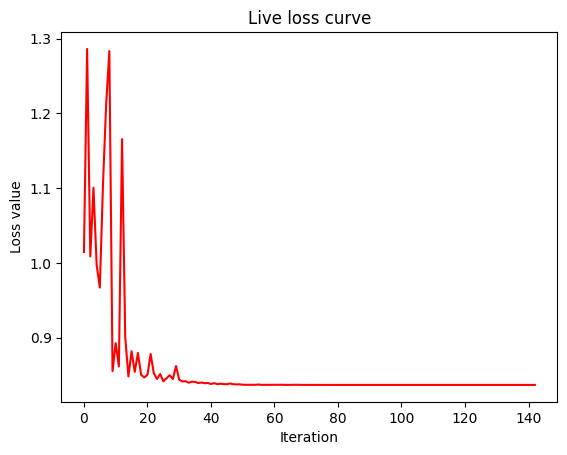
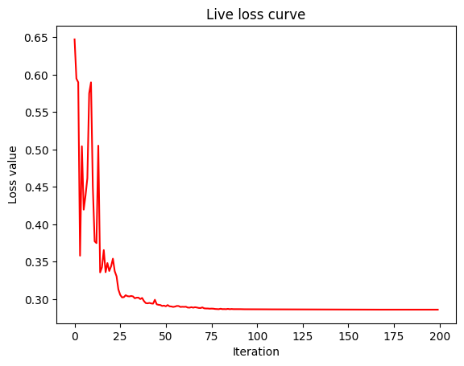

Installing the `Package <https://pypi.org/project/nz-seqtech/>`__
^^^^^^^^^^^^^^^^^^^^^^^^^^^^^^^^^^^^^^^^^^^^^^^^^^^^^^^^^^^^^^^^^

.. code:: ipython3

    !pip install nz-seqtech 

.. parsed-literal::

    Requirement already satisfied: nz-seqtech in /opt/conda/lib/python3.10/site-packages (0.2.2)
    Requirement already satisfied: qiskit-algorithms in /opt/conda/lib/python3.10/site-packages (from nz-seqtech) (0.2.1)
    Requirement already satisfied: qiskit-aer in /opt/conda/lib/python3.10/site-packages (from nz-seqtech) (0.12.2)
    Requirement already satisfied: matplotlib in /opt/conda/lib/python3.10/site-packages (from nz-seqtech) (3.6.3)
    Requirement already satisfied: scikit-learn in /opt/conda/lib/python3.10/site-packages (from nz-seqtech) (1.2.2)
    Requirement already satisfied: qiskit in /opt/conda/lib/python3.10/site-packages (from nz-seqtech) (0.44.1)
    Requirement already satisfied: numpy in /opt/conda/lib/python3.10/site-packages (from nz-seqtech) (1.23.5)
    Requirement already satisfied: pandas in /opt/conda/lib/python3.10/site-packages (from nz-seqtech) (1.5.2)
    Requirement already satisfied: wheel in /opt/conda/lib/python3.10/site-packages (from nz-seqtech) (0.38.4)
    Requirement already satisfied: qiskit-machine-learning in /opt/conda/lib/python3.10/site-packages (from nz-seqtech) (0.6.1)
    Requirement already satisfied: packaging>=20.0 in /opt/conda/lib/python3.10/site-packages (from matplotlib->nz-seqtech) (22.0)
    Requirement already satisfied: contourpy>=1.0.1 in /opt/conda/lib/python3.10/site-packages (from matplotlib->nz-seqtech) (1.0.7)
    Requirement already satisfied: cycler>=0.10 in /opt/conda/lib/python3.10/site-packages (from matplotlib->nz-seqtech) (0.11.0)
    Requirement already satisfied: kiwisolver>=1.0.1 in /opt/conda/lib/python3.10/site-packages (from matplotlib->nz-seqtech) (1.4.4)
    Requirement already satisfied: fonttools>=4.22.0 in /opt/conda/lib/python3.10/site-packages (from matplotlib->nz-seqtech) (4.39.3)
    Requirement already satisfied: python-dateutil>=2.7 in /opt/conda/lib/python3.10/site-packages (from matplotlib->nz-seqtech) (2.8.2)
    Requirement already satisfied: pyparsing>=2.2.1 in /opt/conda/lib/python3.10/site-packages (from matplotlib->nz-seqtech) (3.0.9)
    Requirement already satisfied: pillow>=6.2.0 in /opt/conda/lib/python3.10/site-packages (from matplotlib->nz-seqtech) (9.4.0)
    Requirement already satisfied: pytz>=2020.1 in /opt/conda/lib/python3.10/site-packages (from pandas->nz-seqtech) (2023.3)
    Requirement already satisfied: qiskit-terra==0.25.1 in /opt/conda/lib/python3.10/site-packages (from qiskit->nz-seqtech) (0.25.1)
    Requirement already satisfied: typing-extensions in /opt/conda/lib/python3.10/site-packages (from qiskit-terra==0.25.1->qiskit->nz-seqtech) (4.5.0)
    Requirement already satisfied: scipy>=1.5 in /opt/conda/lib/python3.10/site-packages (from qiskit-terra==0.25.1->qiskit->nz-seqtech) (1.9.3)
    Requirement already satisfied: rustworkx>=0.13.0 in /opt/conda/lib/python3.10/site-packages (from qiskit-terra==0.25.1->qiskit->nz-seqtech) (0.13.0)
    Requirement already satisfied: psutil>=5 in /opt/conda/lib/python3.10/site-packages (from qiskit-terra==0.25.1->qiskit->nz-seqtech) (5.9.4)
    Requirement already satisfied: dill>=0.3 in /opt/conda/lib/python3.10/site-packages (from qiskit-terra==0.25.1->qiskit->nz-seqtech) (0.3.7)
    Requirement already satisfied: stevedore>=3.0.0 in /opt/conda/lib/python3.10/site-packages (from qiskit-terra==0.25.1->qiskit->nz-seqtech) (4.1.1)
    Requirement already satisfied: sympy>=1.3 in /opt/conda/lib/python3.10/site-packages (from qiskit-terra==0.25.1->qiskit->nz-seqtech) (1.11.1)
    Requirement already satisfied: symengine<0.10,>=0.9 in /opt/conda/lib/python3.10/site-packages (from qiskit-terra==0.25.1->qiskit->nz-seqtech) (0.9.2)
    Requirement already satisfied: ply>=3.10 in /opt/conda/lib/python3.10/site-packages (from qiskit-terra==0.25.1->qiskit->nz-seqtech) (3.11)
    Requirement already satisfied: fastdtw in /opt/conda/lib/python3.10/site-packages (from qiskit-machine-learning->nz-seqtech) (0.3.4)
    Requirement already satisfied: setuptools>=40.1.0 in /opt/conda/lib/python3.10/site-packages (from qiskit-machine-learning->nz-seqtech) (67.7.2)
    Requirement already satisfied: joblib>=1.1.1 in /opt/conda/lib/python3.10/site-packages (from scikit-learn->nz-seqtech) (1.2.0)
    Requirement already satisfied: threadpoolctl>=2.0.0 in /opt/conda/lib/python3.10/site-packages (from scikit-learn->nz-seqtech) (3.1.0)
    Requirement already satisfied: six>=1.5 in /opt/conda/lib/python3.10/site-packages (from python-dateutil>=2.7->matplotlib->nz-seqtech) (1.16.0)
    Requirement already satisfied: pbr!=2.1.0,>=2.0.0 in /opt/conda/lib/python3.10/site-packages (from stevedore>=3.0.0->qiskit-terra==0.25.1->qiskit->nz-seqtech) (5.11.1)
    Requirement already satisfied: mpmath>=0.19 in /opt/conda/lib/python3.10/site-packages (from sympy>=1.3->qiskit-terra==0.25.1->qiskit->nz-seqtech) (1.3.0)
    
    [notice] A new release of pip available: 23.1.1 -> 23.3.1
    [notice] To update, run: pip install --upgrade pip

Importing the package
^^^^^^^^^^^^^^^^^^^^^

.. code:: ipython3

    import nz_seqtech

Importing quantum_ml_models module
^^^^^^^^^^^^^^^^^^^^^^^^^^^^^^^^^^

.. code:: ipython3

    import nz_seqtech.quantum_ml_models

Importing QNN class
^^^^^^^^^^^^^^^^^^^

.. code:: ipython3

    from nz_seqtech.quantum_ml_models import QNN

Testing QNN class with a suggested dataset
^^^^^^^^^^^^^^^^^^^^^^^^^^^^^^^^^^^^^^^^^^

.. code:: ipython3

    QNN(suggested_data=True)

.. parsed-literal::

    Classification Report:
                   precision    recall  f1-score   support
    
              -1       0.47      0.73      0.57        11
               1       0.62      0.36      0.45        14
    
        accuracy                           0.52        25
       macro avg       0.55      0.54      0.51        25
    weighted avg       0.56      0.52      0.51        25
    

Testing QNN class with a suggested dataset
^^^^^^^^^^^^^^^^^^^^^^^^^^^^^^^^^^^^^^^^^^

.. code:: ipython3

    # Load data from X.npy and assign it to variable X
    X = numpy.load('x1.npy')
    
    # Load data from Y.npy and assign it to variable Y
    Y = numpy.load('y1.npy')
    
    QNN(X,Y,suggested_data=False)

.. parsed-literal::

    Classification Report:
                   precision    recall  f1-score   support
    
               0       0.00      0.00      0.00         9
               1       0.64      1.00      0.78        16
    
        accuracy                           0.64        25
       macro avg       0.32      0.50      0.39        25
    weighted avg       0.41      0.64      0.50        25
    

