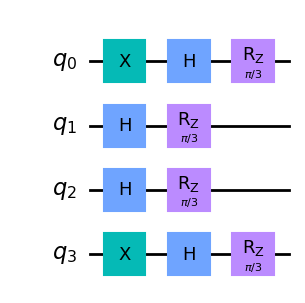

Tutorial-1
~~~~~~~~~~

Importing the package
^^^^^^^^^^^^^^^^^^^^^

.. code:: ipython3

    import nz_seqtech

Importing quantum_dna_encoding module
^^^^^^^^^^^^^^^^^^^^^^^^^^^^^^^^^^^^^

.. code:: ipython3

    from nz_seqtech.quantum_dna_encoding import (
        cosine_encoding, amplitude_encoding, qft_encoding,
        phase_encoding, NZ23_encoding, NZ22_encoding,
        draw_circuit, get_statevector, visualize_bloch_multivector,
        is_valid_dna_seq, visualize_state_hinton,
        visualize_state_city, visualize_state_paulivec
    )

Testing the quantum DNA encoding methods
^^^^^^^^^^^^^^^^^^^^^^^^^^^^^^^^^^^^^^^^

.. code:: ipython3

    dna='AGTC'

.. code:: ipython3

    m1=cosine_encoding(dna)
    draw_circuit(m1)

.. code:: ipython3

    m2=amplitude_encoding(dna)
    draw_circuit(m2)

.. code:: ipython3

    m3=qft_encoding(dna)
    draw_circuit(m3)

.. code:: ipython3

    m4=phase_encoding(dna)
    draw_circuit(m4)

Note: For NZ22 and NZ23 encoding, a reference DNA sequence and the
parameter alpha (float) are both required for encoding.

.. code:: ipython3

    dna_ref='tgcc'
    alpha=0.5

.. code:: ipython3

    m5=NZ23_encoding(dna,dna_ref,alpha)
    draw_circuit(m5)

.. code:: ipython3

    m6=NZ22_encoding(dna,dna_ref,alpha)
    draw_circuit(m6)

Testing the visualization methods
^^^^^^^^^^^^^^^^^^^^^^^^^^^^^^^^^

.. code:: ipython3

    z=get_statevector(m1)

.. code:: ipython3

    visualize_bloch_multivector(z)

.. code:: ipython3

    visualize_state_hinton(z)

.. code:: ipython3

    visualize_state_city(z)

.. code:: ipython3

    visualize_state_paulivec(z)

.. image:: figures/output_20_0.png

**N.B: For more informations and details about the methods, use the help
function.**

Example:
        

.. code:: ipython3

    help(cosine_encoding)

.. parsed-literal::

    Help on function cosine_encoding in module nz_seqtech.quantum_dna_encoding:
    
    cosine_encoding(dna_seq)
        Encodes a DNA sequence into a quantum state using cosine encoding.
        
        Args:
            dna_seq (str): The DNA sequence to be encoded.
        
        Returns:
            QuantumCircuit: The quantum circuit representing the cosine encoding.
    

